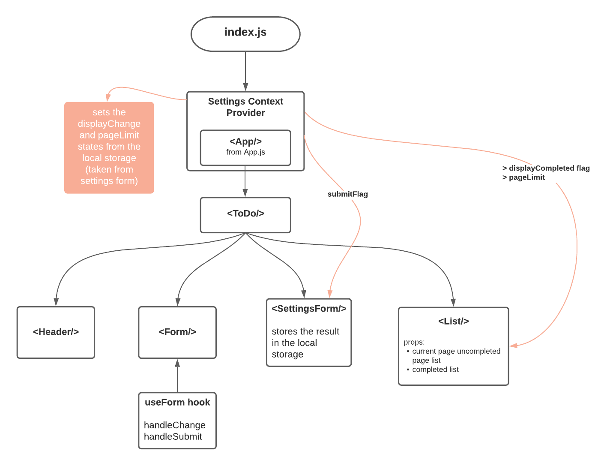

# To Do List Manager

## Deployment

[gh-pages](https://hasnaa38.github.io/todo-app/)

## UML

## Phase 1 [ Lab 31 ] - Context API

In this phase, we’ll be adding some top-level settings for the application, so that the user can make some display choices that the app will use by default. Incorporating configuration settings to the application was done using the React Context API.

* Describe how global state is consumed by the components

In a typical React application, data is passed top-down (parent to child) via props. This approach is known as prop drilling and it can be complicated when data needs to be accessible by many components at different nesting levels, such as the current authenticated user, theme, or preferred language.

Context provides a way to share data between components globally without having to explicitly pass a prop through every level of the tree. Context is designed to share data that can be considered global for a tree of React components.

Steps:

1. we create a Context object for the specific use case we want then we create the Context Provider to allow consuming components to subscribe to context changes.
2. we wrap `App.js` with the Context Component.
3. we import the `useContext()` hook from React (since we are using function components) along with the Context object in the component we want to access a state from. Then, we can use any state from the context like we use props.  

* Describe the operation of the hook: useForm()

It handles the change of the form inputs and the submission of the form:

**handleChange** keeps track of the changes of the form inputs and stores them in the values state.
**handleSubmit** takes the value state when the form is submitted, and passes it to the callback function which is **addItem** from `todo.js`. **addItem** takes the newly added list item and pushes it to the tasks list state.

## Phase 2 [ Lab 32 ] - Context API - Behaviors

In this phase, we’ll be adding a form editor so that users can save their preferences for the application, allowing them to change some of the default behaviors like:

* How many To Do Items to show at once
* Whether or not to show completed items

Also, the users choices will be saved in Local Storage. So each time they will re-visit the page, their choices will still be there.

## Phase 3 [ Lab 33 ] - Context API - Behaviors

In this phase, we'll be extending the functionality of the application by requiring users to login to view items and also restrict access based on the user's role.

The login is done using an auth context.
 
We have the following RBAC rules:

* Logged In Users with `read` permissions can see the summary/count.
* Logged In Users with `read` permissions can see the list of To Do Items.
* Logged In Users with `update` permissions can click the records to mark them as complete.
* Logged In Users with `create` permissions can create new items.
* Logged In Users with `delete` permissions can delete items.
